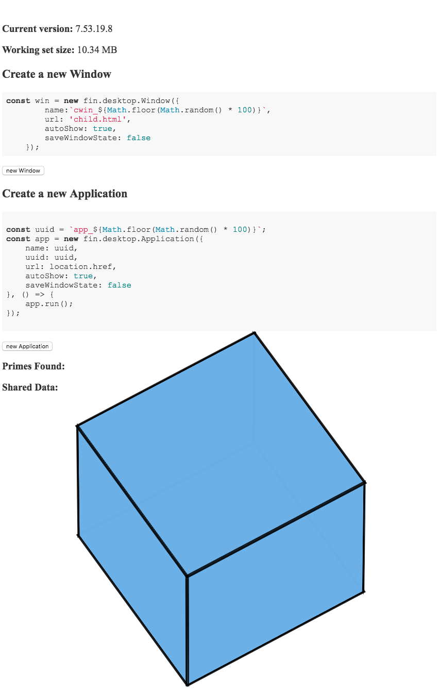

# Writing multi window applications meetup demo

This is the code behind the 5/3/2017 OpenFin meetup.

### Slides
[Slides](https://speakerdeck.com/rdepena/meetup-process-model)

### Running the code

` npm install `

` npm start `
### ScreenShot

## License
MIT

The code in this repository is covered by the included license.  If you run this code, it may call on the OpenFin RVM or OpenFin Runtime, which are subject to OpenFin’s [Developer License](https://openfin.co/developer-agreement/). If you have questions, please contact support@openfin.co

## Support
Please enter an issue in the repo for any questions or problems. Alternatively, please contact us at support@openfin.co
